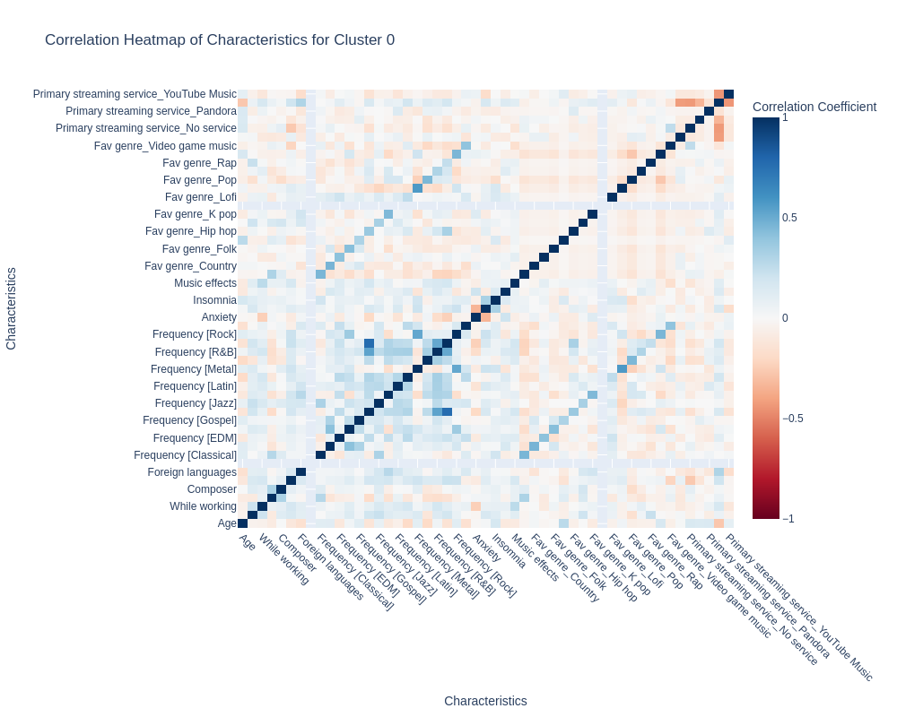
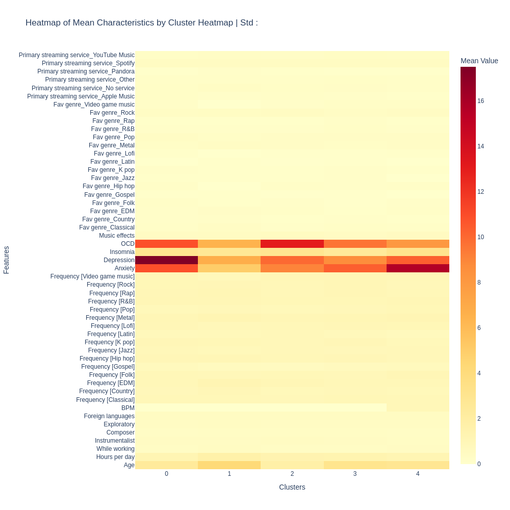
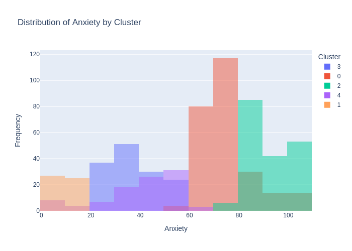
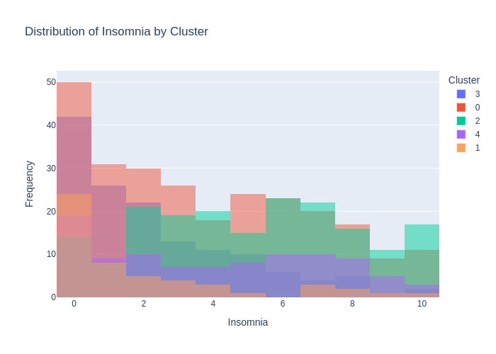
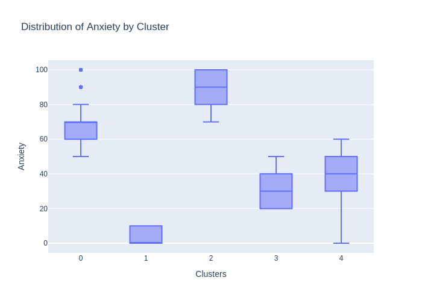
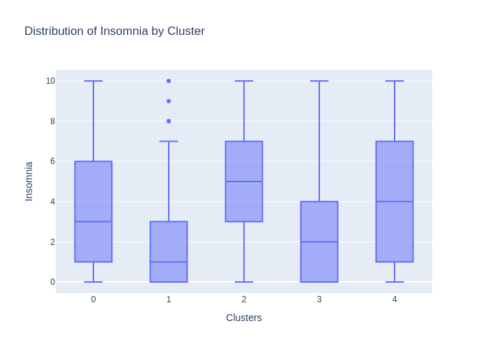

# Social Group Clustering 🎒

Tools to help primary school teacher to manage children based on their psychologic profile using spectral clustering (unsupervised learning).

🚧 Warning  : This is still a proof of work. Research has to be done to prove the beneficial/detrimental effects of those tools applied to real life situations.

## Table of Contents

- [Introduction](#introduction)
- [Features](#features)
- [Setup](#setup)
    - [Installation](#installation)
    - [Run](#run)
- [Future Development](#future-development)

## Introduction

In the following, the tool considers several key psychological metrics to facilitate optimal groupings:

- **Agitation**: High levels of agitation can disrupt focus and group cohesion.
    - **Assumption**: Children with similar levels of agitation are more likely to have affinity and collaborate effectively.
- **Mental Health**: Measures related to emotional well-being, resilience, and stress tolerance.
    - **Goal**: Group children with similar mental health profiles or distribute varied profiles based on project needs.
- **Social Engagement**: Levels of participation, willingness to collaborate, and social interactions.
    - **Goal**: Create groups with balanced or complementary social engagement levels to support inclusive activities.
- **Learning Styles**: Preferences for hands-on activities, visual aids, or verbal instructions.
    - **Assumption**: Grouping by similar or complementary learning styles can enhance collaborative learning outcomes.
- **Temperament**: General disposition, such as being calm, reactive, or adaptable.
    - **Goal**: Form groups with a mix of temperaments to promote balanced interactions.

### Inside a class

Teachers can use this tool to form groups or arrange seating to achieve specific goals, such as minimizing disruptions, enhancing collaboration, or supporting specific learning needs based on students' psychological profiles.

### On multiple classes

School administrators may apply these tools to ensure a balanced distribution of psychological profiles across classes, fostering a more harmonious environment and equitable resource allocation.

### Data Collection Method

To facilitate data collection, teachers can administer a structured survey to students in a game-like format, making the experience engaging and accessible. This survey can consist of two types of questions:

- **Scale Questions**: Students rate statements on a scale from 0 to 10, where 0 represents the minimum level of agreement or relevance, and 10 represents the maximum. 
- **Binary Questions**: True/False or Yes/No questions, encoded as 10 for "True" or "Yes" and 0 for "False" or "No."

Teachers then compile the responses into a `.csv` file, where each column represents a question and each row corresponds to an individual student. If a student does not complete the survey, the software will generate values randomly within the 0-10 range to ensure completeness of the dataset.

To further refine groupings, teachers may assign custom weights to each metric according to its importance in a particular context, allowing for targeted emphasis on specific psychological attributes during the clustering process.


## Features

- Clustering
- Graphics

### Example

Demonstration on ``music_school`` dataset :
- Glimpse of ``clusters.csv``
```
index,cluster
430,0
432,0
674,0
673,0
172,0
671,0
```
- Glimpse of heatmaps
    - <p align="center"></p>
- Glimpse of distributions' histograms
    - <p align="center"></p>
- Glimpse of distributions' boxplots
    - <p align="center"></p>


## Setup

### Installation

- Docker installation
```sh
docker build -t Social-Group-Clustering
```

- conda install of the dependencies :
```sh
conda env create -f environment.yml
```

### Run

```sh
# To launch the docker
docker run -it Social-Group-Clustering
```

```sh
make demo # run the demo
make test # run the tests

python -m client.main --file df.csv # run the client on a specific csv
# optional arguments : --n_clusters, --method, --suffix, --file, --weights
```

## Future Development

- Monitor the psychological effects of the developped tools in real life situation using different features for the clustering.
    - If the clusters properly identify psychological groups
        - There may be a risk that reducing the affinity between children might induce social isolation ?
        - In the other way, increasing too much the affinity inside psychological clusters may polarise too much the children ?
    - Otherwise
        - We need to investigate our approach.
        - Is our model more proefficient to optimize the above metrics than a random clustering ?

- Monitor the affinity between clusters